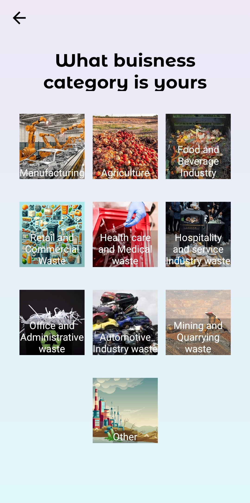

***<h1 align="center"><strong>NaviDisha Vyapar</strong></h1>***

<h2><strong>Description</strong></h2>

<p>TheNaviDisha Vyapar is an innovative solution aimed at connecting companies to facilitate the exchange of waste products. Companies can list their waste products, and other companies can browse and purchase these products for reuse, thus promoting sustainability and reducing environmental impact. This app provides a platform where waste can be transformed into a valuable resource, supporting a circular economy.</p>

<h2><strong>Features</strong></h2>

- **User Authentication**: Secure user login and registration system.
- **Waste Listings**: Companies can list their waste products, including detailed descriptions, images, and pricing.
- **Search and Filter**: Users can search and filter waste products based on type, location, and other criteria.
  
<h2><strong>Technologies Used</strong></h2>

- **Kotlin**: The primary programming language used for developing the app.
- **Firebase**: Used as the backend service for real-time database management, user authentication, and cloud storage.
- **Android Studio**: The integrated development environment (IDE) used for developing and testing the app.

<h2><strong>Project Timeline</strong></h2>

- **Start Date**: August 2nd, 2024
- **End Date**: August 20th, 2024

<h2><strong>Team Members and Contributions</strong></h2>

<h3>Frontend Team:</h3>

- **Akilesh**:
  - Designed and implemented the user interface, focusing on a seamless user experience.
  - Worked on the integration of frontend components with Firebase.
  -  Worked on the in-app purchase feature, integrating it with Firebase.
  - Ensured the app adhered to Material Design principles.

- **Vineeth Raghavendra**:
  - Collaborated on UI/UX design, focusing on responsive layouts and accessibility.
  - Developed the notification and search/filter features
  - Added constrains to layouts
  


- **Luvkush**:
  - Created the company profile and waste listing screens.
  - Implemented chat functionality between companies.
  - Ensured the app adhered to Material Design principles.


- **Lachiram Nayak**:
   - Collaborated on UI/UX design, focusing on responsive layouts and accessibility.
   - Searched all images and put in layouts
   - Added constrains to layouts
   - Assisted in testing and debugging the frontend components.

<h3>Backend Team:</h3>

- **Preet Bobde**:
  - Developed the backend logic using Firebase, focusing on data management and user authentication.
  - Implemented the database schema for waste listings and user profiles.

- **Shivadharshan**:
  - Worked on integrating real-time data updates and notifications.
  - Developed the analytics dashboard and data visualization tools.

<h2><strong>Screenshots</strong></h2>

- **Login Screen with secure authentication**.
- **Company profile showcasing waste listings**.
- **Search and filter waste products**.
- **Streamlined purchasing process**.
<div style="display: flex; justify-content: space-between;">
    <figure>
    
    <figcaption> </figcaption>
    </figure>
    <figure>
    
    <figcaption> </figcaption>
    </figure>
    <figure>
    
    <figcaption> </figcaption>
    <figure>
</div>


<div style="display: flex; justify-content: space-between;">
    <figure>
    
    <figcaption> </figcaption>
    </figure>
    <figure>
    
    <figcaption> </figcaption>
    </figure>
    <figure>
    
    <figcaption> </figcaption>
    </figure>
</div>

<div style="display: flex; justify-content: space-between;">
<figure>
    
    <figcaption> </figcaption>
    </figure>
    <figure>
    
    <figcaption> </figcaption>
    </figure>
    <figure>
    
    <figcaption> </figcaption>
    </figure>
</div>

<div style="display: flex; justify-content: space-between;">
    <figure>
    
    <figcaption> </figcaption>
    </figure>
    <figure>
    
    <figcaption> </figcaption>
    </figure>
    <figure>
    
    <figcaption> </figcaption>
    </figure>
</div>

<div style="display: flex; justify-content: space-between;">
<figure>
    
    <figcaption> </figcaption>
    </figure>
    <figure>
    
    <figcaption> </figcaption>
    </figure>
    <figure>
    
    <figcaption> </figcaption>
    </figure>
</div>


<h2><strong>Installation and Setup</strong></h2>

1. Clone the repository: 
```bash
git clone https://github.com/Shiva9361/NayiDishaVyapar.git
```
2. Open the project in Android Studio.
4. Build and run the app on an Android device or emulator.

<h2><strong>Conclusion</strong></h2>

<p>NaviDisha Vyapar is a project aimed towards achieving the sustainability goal SDG 11 by facilitating growth of circular economy in measure metro areas across the country by connecting companies and providing a medium to exchange of waste products. We aim to contribute to a more sustainable and resource-efficient future.</p>
